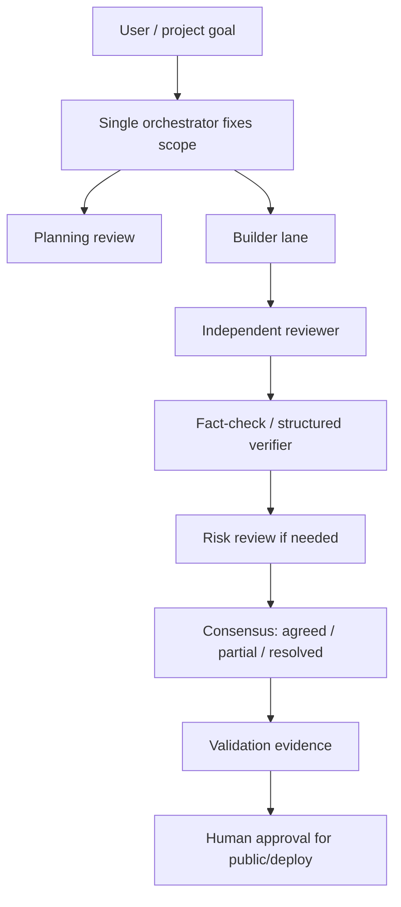

# Agent Team Flow

```mermaid
flowchart TD
  A[User / project goal] --> B[Single orchestrator fixes scope]
  B --> C[Planning review]
  B --> D[Builder lane]
  D --> E[Independent reviewer]
  E --> F[Fact-check / structured verifier]
  F --> G[Risk review if needed]
  G --> H[Consensus: agreed / partial / resolved]
  H --> I[Validation evidence]
  I --> J[Human approval for public/deploy]
```
