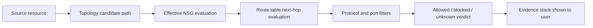

# AzVision Path Analysis Flow

Text summary: AzVision starts from a source resource, evaluates candidate topology, NSG rules, route-table next hops, protocol and port filters, then returns an allowed, blocked, or unknown verdict with supporting evidence.

