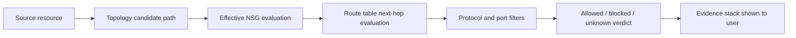

# AzVision Path Analysis Flow

```mermaid
flowchart LR
  S[Source resource] --> T[Topology candidate path]
  T --> N[Effective NSG evaluation]
  N --> R[Route table next-hop evaluation]
  R --> P[Protocol and port filters]
  P --> V[Allowed / blocked / unknown verdict]
  V --> E[Evidence stack shown to user]
```
