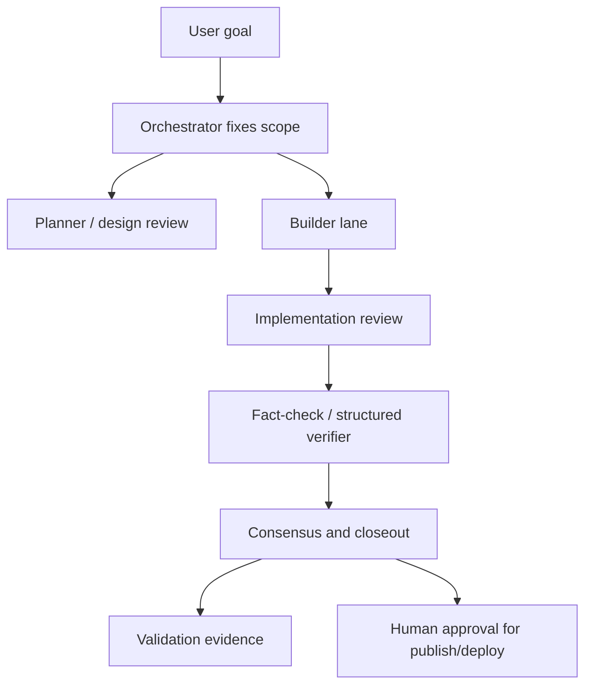

# AI-Assisted Engineering Control Plane

## 60-second summary

The goal was to use AI tools without losing engineering discipline. The resulting workflow separates planning, building, review, fact-checking, and risk review into role-based lanes, while a single orchestrator keeps scope, approval, and final decisions centralized.

## Problem

Using multiple AI tools can increase output, but it can also create operational risk:

- unclear ownership of final decisions
- weak distinction between draft output and validated output
- reviewers added too late or skipped entirely
- no durable evidence trail for long-running work
- unsafe handling of credentials, deployment, or private logs

For infrastructure work, these gaps matter because mistakes can affect security, availability, cost, or data exposure.

## Design principles

1. **Single front, multiple lanes**  
   One orchestrator owns scope, user communication, final decisions, and tool execution. Specialist lanes provide independent input.

2. **Role-based review instead of invisible auto-routing**  
   Lanes are selected by purpose: planning, implementation, review, breadth research, fact-check, risk review, and smoke testing.

3. **Consensus over raw model output**  
   Important work ends with agreement, disagreement, and adoption rationale, not just a summary.

4. **Human approval for external or irreversible actions**  
   Publishing, deployment, account changes, credential handling, and destructive operations require explicit approval.

5. **Public-safe evidence**  
   The workflow records validation results and decisions without exposing secrets or private runtime details.

## Workflow

## What this demonstrates

- AI workflow governance
- infrastructure-safe execution discipline
- review separation between builder and verifier
- operating-model design, not just prompt usage
- security-minded documentation practices

## Example lane mapping

| Role | Purpose | Public-safe description |
|---|---|---|
| Orchestrator | Scope, tools, final decision | Single accountable front |
| Planner / design reviewer | Architecture critique | Deep review lane |
| Builder | Implementation draft | Code-producing lane |
| Reviewer | Test gaps and correctness | Independent review lane |
| Fact-checker | Structured verification | Verification lane |
| Risk reviewer | Security, deployment, privacy | Risk gate |
| Smoke tester | Quick behavior check | Lightweight validation |

Specific model names, private account details, internal channel IDs, and runtime configuration are intentionally omitted from the public version.

## Evidence pattern

A strong closeout should include:

- what changed
- what was validated
- what reviewers agreed on
- what disagreement appeared and how it was resolved
- what remains risky or incomplete
- whether the work is approved for public release or still draft-only

## Hiring signal

This is the difference between “I use AI tools” and “I designed a governed AI-assisted engineering workflow.” The latter is more relevant to infrastructure, security, and cloud architecture roles because it shows judgment under operational constraints.
