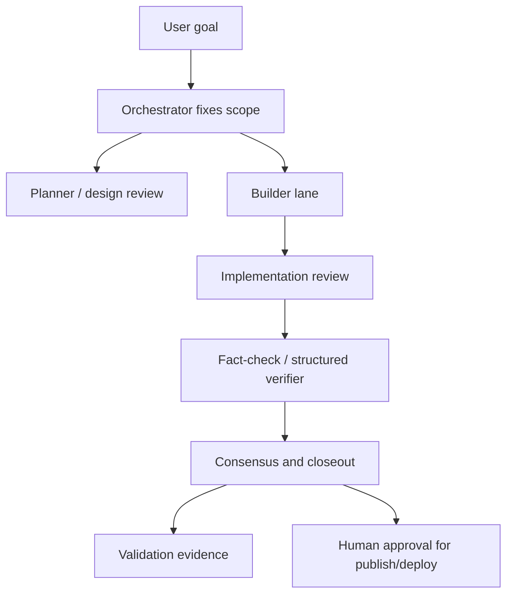

# AI Engineering Control Plane

## 60-second summary

The goal was to use multiple AI tools without losing engineering discipline. The resulting workflow uses OpenClaw as the current orchestration layer across coding agents, CLI tools, browser automation, local scripts, GitHub, and deployment workflows, while role-based lanes keep planning, building, review, fact-checking, risk review, and closeout separate.

## Problem

Using multiple AI tools can increase output, but it can also create operational risk:

- unclear ownership of final decisions
- weak distinction between draft output and validated output
- reviewers added too late or skipped entirely
- no durable evidence trail for long-running work
- unsafe handling of credentials, deployment, or private logs

For personal app development and infrastructure work, these gaps matter because mistakes can affect security, availability, cost, data exposure, or public credibility.

## Design principles

1. **Single front, multiple lanes**  
   One orchestrator owns scope, user communication, final decisions, and tool execution. OpenClaw is the current orchestrator, but the pattern is tool-agnostic and can expand as better tools appear.

2. **Role-based review instead of invisible auto-routing**  
   Lanes are selected by purpose: planning, implementation, review, breadth research, fact-check, risk review, and smoke testing.

3. **Consensus over raw model output**  
   Important work ends with agreement, disagreement, and adoption rationale, not just a summary.

4. **Human approval for external or irreversible actions**  
   Publishing, deployment, account changes, credential handling, and destructive operations require explicit approval.

5. **Public-safe evidence**  
   The workflow records validation results and decisions without exposing secrets or private runtime details.

## Workflow

## What this demonstrates

- AI workflow governance
- multi-tool orchestration across AI coding tools and CLI workflows
- infrastructure-safe execution discipline
- review separation between builder and verifier
- operating-model design, not just prompt usage
- security-minded documentation practices

## Example lane mapping

| Role | Purpose | Public-safe description |
|---|---|---|
| Orchestrator | Scope, tools, final decision | Single accountable front |
| Planner / design reviewer | Architecture critique | Deep review lane |
| Builder | Implementation draft | Code-producing lane |
| Reviewer | Test gaps and correctness | Independent review lane |
| Fact-checker | Structured verification | Verification lane |
| Risk reviewer | Security, deployment, privacy | Risk gate |
| Smoke tester | Quick behavior check | Lightweight validation |

Specific model names, private account details, internal channel IDs, and runtime configuration are intentionally omitted from the public version.

## Evidence pattern

A strong closeout should include:

- what changed
- what was validated
- what reviewers agreed on
- what disagreement appeared and how it was resolved
- what remains risky or incomplete
- whether the work is approved for public release or still draft-only

## Concrete example: disagreement to closeout

A practical harness run should make disagreement visible instead of hiding it in a chat transcript.

One public-safe pattern:

1. **Builder lane** drafts an implementation or documentation change.
2. **Reviewer lane** flags a risk, such as wording that could imply autonomous deployment or a claim that is stronger than the available evidence.
3. **Fact-check / risk lane** narrows the issue: what is safe, what needs softer wording, and what evidence is required.
4. **Orchestrator** adopts the safe framing, updates the artifact, and records the rationale.
5. **Validation** reruns link checks, package scans, or smoke tests before the work is treated as publishable.

Example closeout wording:

> Reviewer flagged an over-strong public claim. The wording was changed from an absolute capability claim to a supervised, evidence-backed workflow claim. Public package checks and link smoke passed after the revision.

This is the part I want to demonstrate: AI can accelerate drafting, but the engineering value comes from review separation, evidence, and accountable adoption.

## Hiring signal

This is the difference between “I use AI tools” and “I designed a governed AI engineering system.” The latter shows judgment under operational constraints and also demonstrates a broader personal engineering capability beyond one job function or tool.
