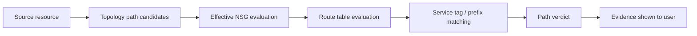

# AzVision App Development: Network Path Analysis

## 60-second summary

| Field | Summary |
|---|---|
| Problem | Azure network path verdicts can be misleading if NSG direction, service tags, effective NSG composition, route next hops, and port filters are not evaluated carefully. |
| Role | Designed and orchestrated an app hardening slice, using Azure networking domain knowledge, AI-assisted implementation, and independent review lanes while keeping final technical decisions human-directed. |
| Outcome | Improved path-analysis correctness and explainability across backend, API, frontend, documentation, and tests. |
| Proof | 110 targeted backend tests passed, frontend build passed, earlier full backend regression showed 235 tests passed. |

## Problem

Cloud network troubleshooting often fails when the analysis stops at a topology graph. A graph can show that resources are connected, but it may not explain whether traffic is actually allowed, blocked, or unknown.

For an Azure path-analysis tool, the verdict must account for control-plane data such as:

- outbound and inbound NSG rules
- NIC-level and subnet-level effective NSG composition
- service tags such as virtual network, internet, load balancer, and storage categories
- route table longest-prefix matching and next-hop semantics
- source and destination ports
- uncertainty when data is incomplete

The risk is not only returning the wrong answer. The larger risk is returning a confident answer without enough evidence.

## Solution

The hardening slice focused on making the path verdict more conservative, explainable, and test-backed.

### Key changes

- Evaluated source-side outbound NSG rules and destination-side inbound NSG rules.
- Combined NIC and subnet NSGs as effective control data instead of treating either one in isolation.
- Added a service-tag foundation for common Azure service tag categories.
- Modeled route next-hop behavior conservatively.
- Surfaced the actual winning NSG rule and evidence names in the path-analysis response/UI.
- Added a `source_port` filter across backend, API contract, frontend, documentation, and tests.
- Preserved `unknown` as a first-class verdict when the input data is insufficient.

## Architecture view

## Validation

| Validation item | Result |
|---|---:|
| Targeted backend tests | 110 passed |
| Frontend build | Passed |
| Earlier full backend regression | 235 passed |
| Review status | Findings addressed before closeout |

## Before / after

| Before | After |
|---|---|
| Path verdict could rely too heavily on graph reachability. | Verdict includes NSG, service tag, route, and port evidence. |
| Route and NSG uncertainty could be under-explained. | Unknown and blocked states are surfaced more conservatively. |
| Users had less visibility into which rule drove the result. | Winning rule and evidence names are exposed. |
| Port matching was less complete. | Source and destination port filters are represented through the stack. |

## Engineering signal

This case study is meant to show:

- Azure network security understanding
- infrastructure architecture judgment translated into working software
- correctness-first troubleshooting design
- conservative modeling under incomplete cloud data
- test-backed delivery
- AI-assisted workflow used as a reviewable engineering process, not as unchecked automation

## Public-data boundary

This document intentionally avoids real subscription IDs, tenant IDs, resource names, customer data, private topology exports, and hosting/runtime details. Future demos should use synthetic Azure-like samples only.

## Next steps

- Add a synthetic Azure export fixture to make the case study runnable without private data.
- Add a visual before/after screenshot with sensitive labels removed.
- Build a short portfolio page section that links this case study to Azure/network security roles.
