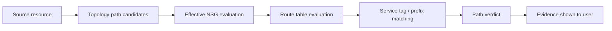

# AzVision App Development

## 60초 요약

| 항목 | 요약 |
|---|---|
| 문제 | Azure network path verdict는 NSG 방향, service tag, effective NSG 구성, route next hop, port filter를 함께 보지 않으면 쉽게 오해될 수 있습니다. |
| 역할 | Azure networking 도메인 지식과 AI-assisted implementation, independent review lane을 결합해 app hardening slice를 설계하고 조율했습니다. |
| 결과 | backend, API, frontend, documentation, test 전반에서 path-analysis 정확도와 설명 가능성을 개선했습니다. |
| 증거 | targeted backend test 110개 통과, frontend build 통과, 이전 full backend regression 235개 통과. |

## 문제

Cloud network troubleshooting은 topology graph만으로 끝나면 부족합니다. graph는 resource가 연결되어 있음을 보여줄 수 있지만, 실제 traffic이 allowed, blocked, unknown 중 어디에 해당하는지는 설명하지 못할 수 있습니다.

Azure path-analysis app은 다음 control-plane data를 함께 고려해야 합니다.

- outbound / inbound NSG rule
- NIC level / subnet level effective NSG 구성
- virtual network, internet, load balancer, storage 같은 service tag category
- route table longest-prefix matching과 next-hop semantics
- source / destination port
- data가 부족할 때의 uncertainty

더 큰 위험은 단순히 틀린 답을 내는 것이 아니라, 충분한 evidence 없이 너무 확신 있는 답을 내는 것입니다.

## 해결 방향

이번 slice는 path verdict를 더 conservative하고 explainable하며 test-backed하게 만드는 데 집중했습니다.

### 주요 변경

- source-side outbound NSG rule과 destination-side inbound NSG rule을 평가했습니다.
- NIC와 subnet NSG를 effective control data로 조합했습니다.
- 일반적인 Azure service tag category를 위한 static foundation을 추가했습니다.
- route next-hop behavior를 conservative하게 모델링했습니다.
- winning NSG rule과 evidence name을 path-analysis response/UI에 노출했습니다.
- `source_port` filter를 backend, API contract, frontend, documentation, test에 반영했습니다.
- input data가 부족하면 `unknown` verdict를 first-class 상태로 유지했습니다.

## Architecture view

## 검증

| 검증 항목 | 결과 |
|---|---:|
| Targeted backend tests | 110 passed |
| Frontend build | Passed |
| Earlier full backend regression | 235 passed |
| Review status | Findings addressed before closeout |

## Before / After

| Before | After |
|---|---|
| Path verdict가 graph reachability에 너무 의존할 수 있었습니다. | Verdict가 NSG, service tag, route, port evidence를 함께 보여줍니다. |
| Route와 NSG uncertainty가 충분히 설명되지 않을 수 있었습니다. | Unknown과 blocked 상태를 더 conservative하게 드러냅니다. |
| 어떤 rule이 결과를 만들었는지 사용자가 보기 어려웠습니다. | Winning rule과 evidence name을 노출합니다. |
| Port matching이 덜 완전했습니다. | Source / destination port filter를 stack 전반에 반영했습니다. |

## 포트폴리오 시그널

이 case study는 다음을 보여주기 위한 것입니다.

- Azure network security 이해
- infrastructure architecture 판단을 working software로 옮기는 능력
- incomplete cloud data 아래에서 conservative modeling을 하는 방식
- test-backed delivery
- unchecked automation이 아니라 reviewable engineering process 안에서 AI-assisted workflow를 쓰는 방식

## 공개 데이터 경계

이 문서는 real subscription ID, tenant ID, resource name, customer data, private topology export, hosting/runtime detail을 포함하지 않습니다. 향후 demo도 synthetic Azure-like sample만 사용해야 합니다.

## 다음 단계

- private data 없이 실행 가능한 synthetic Azure export fixture 추가
- 민감 label을 제거한 before/after screenshot 추가
- Azure/network security role과 연결되는 짧은 portfolio section 보강
